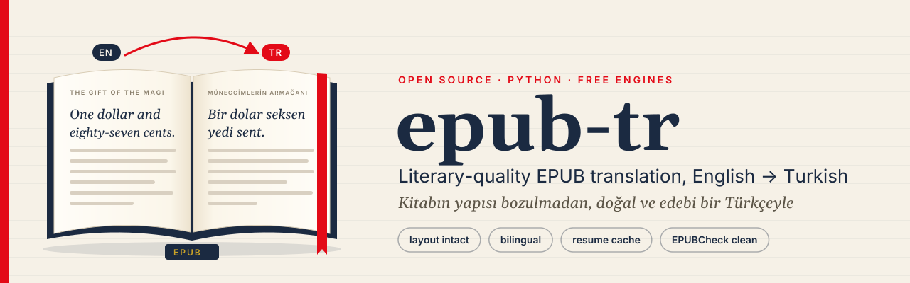

<p align="center">
  
</p>

# epub-tr — edebi kalitede EPUB çevirmeni (önce Türkçe)

[](README.md)
[](README.tr.md)
[](https://github.com/cumabozkurt/epub-tr/actions/workflows/ci.yml)
[](https://github.com/cumabozkurt/epub-tr/actions/workflows/codeql.yml)
[](https://github.com/cumabozkurt/epub-tr/releases/latest)
[](pyproject.toml)
[](LICENSE)
[](TEST_REPORT.tr.md)

**İçindekiler:** [Özellikler](#özellikler) · [Hangi motor?](#hangi-motor) · [Motorlar](#motorlar) · [Kurulum](#kurulum) ·
[Hızlı başlangıç](#hızlı-başlangıç) · [Kullanım](#kullanım) · [Yapılandırma](#yapılandırma) · [Mimari](#mimari) ·
[Sorun giderme](#sorun-giderme) · [SSS](#sss) · [Testler](#testler) · [Yol haritası](#yol-haritası) ·
[Katkıda bulunma](#katkıda-bulunma) · [Lisans](#lisans)

**Belgeler:** [Mimari](docs/ARCHITECTURE.tr.md) · [Motorlar ve ölçülmüş sıralama](docs/ENGINES.tr.md) ·
[CI ve sürümler](docs/AUTOMATION.tr.md) · [Test raporu](TEST_REPORT.tr.md) · [Araştırma](RESEARCH.md) ·
[Değişiklik günlüğü](CHANGELOG.tr.md)

`epub-tr`, EPUB kitapları **doğal ve edebi bir Türkçeye** çevirir; kitabın yapısını bozmaz:
HTML biçimlendirmesi, görseller, CSS, yazı tipleri, içindekiler (nav + NCX), üst veriler ve
kitap içi bağlantılar korunur. Tüm motorlar **ücretsizdir** (ücretli API anahtarı gerekmez).

## Özellikler

* **Yapıyı koruyan EPUB okuma/yazma** – `ebooklib` + `lxml` ile okuma; yazma ZIP düzeyinde yapılır:
  orijinal dosyalar bayt bayt kopyalanır, yalnızca çevrilen XHTML'ler, OPF (`dc:language` → `tr`,
  çevrilmiş başlık) ve NCX/nav etiketleri değiştirilir. Çıktı EPUBCheck'ten girdi kadar temiz geçer.
* **Satır içi biçim korunur** – `<i>`, `<em>`, `<a id=…>`, `<br/>`, dipnot bağlantıları motor için
  `<g1>…</g1>`, `<x2/>` yer tutucularına çevrilir ve sonra tüm öznitelikleriyle geri kurulur.
* **İki dilli mod** (`--bilingual`) – her paragrafın altına çevirisi eklenir.
* **Edebi LLM hattı**
  * paragraflar `<seg id>` kimlikli parçalara bölünür (`--chunk-chars`),
  * **bağlam penceresi**: önceki paragraflar (kaynak + çeviri) her istekle gönderilir,
  * **yürüyen sözlük**: model ad/terim kararlarını bildirir, kitabın geri kalanında aynen kullanılır
    (önbellekte saklanır → devam ettirmede tutarlılık); `--glossary` ile kendi sözlüğünüzü verin,
  * otomatik **özel ad tespiti** (adlar korunur, ekler kesme işaretiyle: *Della'nın*, *Jim'e*),
  * Türkçe edebi sistem istemi: deyimsel anlatım, üslup/ton/dönem korunur, TDK yazımı, sen/siz
    tutarlılığı, diyalog noktalaması (`--dialogue quotes|dash` → tırnak ya da uzun çizgi),
  * isteğe bağlı **ikinci gözden geçirme/redaksiyon geçişi** (`--polish`, istenirse başka motorla
    `--polish-engine`).
* **Hız ve dayanıklılık** – eşzamanlılık (LLM'de bölümler paralel), SQLite önbellek = **kaldığı yerden
  devam**, yeniden deneme, parça bazında **yedek motor zinciri** (`--fallback google,argos`), OpenCode
  ücretsiz kota sınırında hızlı hata ve diğer ücretsiz modellere otomatik geçiş.

## Hangi motor?

O. Henry'nin *The Gift of the Magi* öyküsünde ölçüldü (51 parça, 11.237 karakter; ayrıntılar
[TEST_REPORT.tr.md](TEST_REPORT.tr.md) içinde, çıktılar [`out/`](out) klasöründe):

| sıra | ayar | edebi kalite | süre | örnek |
|---|---|---|---|---|
| 🥇 | `--engine opencode --polish` (ücretsiz `opencode/space-bunny-free`) | **en iyisi**: düzeltilmiş Türkçe düzyazı gibi | 6.932 sn | "Birer ikişer kuruş biriktirmek için bakkala, manava ve kasaba gözünü karartıyordu…" |
| 🥈 | `--engine opencode` (taslak) | deyimsel, birkaç yazım hatası ("srma", "uyacak") | 3.730 sn | |
| 🥉 | `--engine bing` | en doğal makine çevirisi | 43 sn | "…kasapla pazarlık yaparken…" |
| 4 | `--engine google` | akıcı ama birebir, kurulum gerekmez | 1,7 sn | "…buldozerlerle ezerek…" |

**Önerilen:** `epub-tr translate kitap.epub --engine opencode --polish --fallback bing`. OpenCode ücretsiz
katmanı IP başına sınırlı ve yavaş (bizim çalıştırmamızda çağrı başına yaklaşık 5 dakika), bu yüzden bazı
öbekler başarısız olabilir. Aynı komutu sonra yeniden çalıştırın: biten parçalar önbellekten gelir, modele
yalnızca boşluklar gider. Hız gerekiyorsa `--engine bing` ya da `--engine google`. 8 motorun tam sıralaması:
[docs/ENGINES.tr.md](docs/ENGINES.tr.md).

## Motorlar

| motor | tür | gereksinim |
|---|---|---|
| `opencode` | `opencode run` ile LLM (OpenCode Zen **ücretsiz** modelleri: big-pickle, nemotron-3-ultra-free, mimo-v2.6-flash-free, …) | `npm i -g opencode-ai` |
| `ollama` | yerel LLM (varsayılan `gemma3:4b`; `aya-expanse:8b` önerilir) | Ollama |
| `google` | Google Çeviri ücretsiz uç noktaları | – |
| `bing`, `yandex`, `modernmt` | `translators` paketi (GPL-3, isteğe bağlı) | `pip install translators` |
| `mymemory` | MyMemory API (anonim ~5 bin karakter/gün) | – |
| `lingva` | Lingva genel sunucuları (`LINGVA_URL`) | – |
| `libretranslate` | LibreTranslate sunucusu | kendi sunucunuz veya anahtar |
| `argos` | Argos Translate, tamamen çevrimdışı | `pip install argostranslate` |
| `openrouter`, `gemini`, `groq`, `mistral`, `openai` | OpenAI uyumlu API'ler (ücretsiz katmanlar) | ilgili API anahtarı |

## Kurulum

```bash
python3 -m venv .venv && . .venv/bin/activate
pip install -e .                 # çekirdek (Python 3.10+)
pip install -e '.[argos,extra]'  # çevrimdışı Argos + Bing/Yandex/ModernMT
npm i -g opencode-ai             # OpenCode CLI (ücretsiz LLM'ler)
```

## Hızlı başlangıç

```bash
git clone https://github.com/cumabozkurt/epub-tr.git && cd epub-tr
python3 -m venv .venv && . .venv/bin/activate
pip install -e .
epub-tr engines --check                                  # bu makinede hangi motorlar çalışıyor?
epub-tr inspect samples/pg7256.epub --show 10           # neler çevrilecek?
epub-tr translate samples/pg7256.epub -e google -o magi.tr.epub   # ~2 sn, kurulum gerektirmez
```

## Kullanım

```bash
# en iyi ücretsiz kalite: OpenCode LLM + redaksiyon, yedek olarak Bing (boşlukları doldurmak için sonra yeniden çalıştırın)
epub-tr translate kitap.epub -o kitap.tr.epub --engine opencode --polish --fallback bing

# OpenCode modelini açıkça seçmek
epub-tr translate kitap.epub --engine opencode -m opencode/nemotron-3-ultra-free

# yerel ve gizli
epub-tr translate kitap.epub --engine ollama -m aya-expanse:8b --chunk-chars 1500

# hızlı, iki dilli baskı
epub-tr translate kitap.epub --engine google --bilingual

# yalnızca 1-3. bölümler, ilk 50 paragraf, uzun çizgili diyalog, kendi sözlüğünüz
epub-tr translate kitap.epub --chapters 1-3 --limit 50 --dialogue dash --glossary adlar.tsv

epub-tr engines --check      # hangi motorlar kullanılabilir?
epub-tr inspect kitap.epub   # neler çevrilecek?
```

Diğer yararlı seçenekler: `--source en` (varsayılan: üst veriden), `--target tr`, `--workers N`,
`--context 3`, `--retries 3`, `--no-toc`, `--keep-boilerplate` (Project Gutenberg başlık/lisans
metnini de çevirir; varsayılan olarak atlanır), `--cache YOL`, `--no-cache`, `--stats out.json`,
`--dump pairs.jsonl`.

## Yapılandırma

### `epub-tr translate` seçenekleri

| seçenek | varsayılan | anlamı |
|---|---|---|
| `input` | – | kaynak `.epub` |
| `-o, --output` | `<girdi>.<hedef>.epub` (`--bilingual` ile `<girdi>.bilingual.<hedef>.epub`) | çıktı yolu |
| `-e, --engine` | `opencode` | ana motor (bkz. [Motorlar](#motorlar)) |
| `-m, --model` | motorun varsayılanı | LLM motorları için model (`opencode/big-pickle`, `gemma3:4b`, …) |
| `--fallback` | – | ana motor başarısız olursa parça başına denenecek motorlar, ör. `google,argos` |
| `-s, --source` | `dc:language`, yoksa `en` | kaynak dil |
| `-t, --target` | `tr` | hedef dil |
| `--bilingual` | kapalı | özgün paragrafı korur, çeviriyi altına ekler |
| `--polish` | kapalı | ikinci LLM geçişi: edebi gözden geçirme/redaksiyon |
| `--polish-engine`, `--polish-model` | aynı LLM | redaksiyon geçişinin motoru/modeli |
| `--dialogue` | `quotes` | diyalog biçimi: `quotes` (“…”) ya da `dash` (— …) |
| `--glossary` | – | başlangıç sözlüğü (aşağıya bakın) |
| `-w, --workers` | motorun varsayılanı | paralel işçi sayısı (LLM'de bölümler, MT'de toplu istekler) |
| `--chunk-chars` | `2500` | LLM isteği başına kaynak karakter |
| `--context` | `3` | bağlam olarak gönderilen önceki paragraf sayısı |
| `--retries` | `3` | parça başına yeniden deneme (üstel bekleme) |
| `--chapters` | tümü | çevrilecek içerik belgeleri, 1'den başlar: `1-3,5` |
| `--limit` | – | yalnızca ilk N parça (deneme için) |
| `--no-toc` | kapalı | nav/NCX etiketlerini çevirme |
| `--keep-boilerplate` | kapalı | Project Gutenberg başlık/lisans metnini de çevir |
| `--cache` / `--no-cache` | `~/.cache/epub-tr/cache.sqlite3` | SQLite çeviri önbelleği (devam ettirme) |
| `--stats DOSYA` | – | JSON özet yazar (son sözlük dahil) |
| `--dump DOSYA` | – | JSONL `{uid, source, translation, engine}` çiftleri yazar |
| `-q, --quiet` | kapalı | ilerleme çubuğu yok |
| `-v, --verbose` (genel) | kapalı | INFO günlükleri |

Diğer alt komutlar: `epub-tr engines [--check]`, `epub-tr inspect KİTAP [--show N]`, `epub-tr --version`.

**Çıkış kodu:** seçilen tüm parçalar çevrildiyse `0`, çevrilemeyen parça kaldıysa `2` (bu parçalar özgün dilde
kalır; daha sonra yeniden çalıştırarak önbellek ve diğer motorlarla tamamlayabilirsiniz). Her çalıştırmada stderr'e
JSON özet (parça sayısı, motor kullanımı, hatalar, önbellek isabetleri, sözlük boyutu) yazılır.

### Sözlük dosyası

`--glossary` JSON (`{"Della": "Della", "Madame Sofronie": "Madam Sofronie"}`) ya da her satırda bir kayıt olan
metin dosyası kabul eder; ayraç `=>`, SEKME ya da `=` olabilir; boş satırlar ve `#` yorumları atlanır:

```text
# adlar.tsv
Madame Sofronie => Madam Sofronie
the Magi	Müneccimler
```

### Ortam değişkenleri

| değişken | kullanan | varsayılan |
|---|---|---|
| `EPUB_TR_CACHE` | önbellek yolu | `$XDG_CACHE_HOME/epub-tr/cache.sqlite3` |
| `EPUB_TR_OPENCODE_MODEL` | opencode | `opencode/big-pickle` |
| `EPUB_TR_OPENCODE_TIMEOUT` | opencode (çağrı başına saniye) | `600` |
| `OPENCODE_BIN` | opencode ikili dosyası | `PATH`'teki `opencode`, sonra `~/.opencode/bin/opencode` |
| `EPUB_TR_OLLAMA_MODEL` | ollama | `gemma3:4b` |
| `OLLAMA_HOST` | ollama | `http://localhost:11434` |
| `EPUB_TR_OLLAMA_CTX` / `EPUB_TR_OLLAMA_MAX_TOKENS` / `EPUB_TR_OLLAMA_TIMEOUT` | ollama | `8192` / otomatik / `1800` |
| `MYMEMORY_EMAIL` | mymemory (günlük kotayı artırır) | – |
| `LINGVA_URL` | lingva sunucusu | yerleşik genel liste |
| `LIBRETRANSLATE_URL`, `LIBRETRANSLATE_API_KEY` | libretranslate | `http://localhost:5000` |
| `OPENROUTER_API_KEY`, `GEMINI_API_KEY`, `GROQ_API_KEY`, `MISTRAL_API_KEY`, `OPENAI_API_KEY` | API hazır ayarları | – |
| `EPUB_TR_<AYAR>_MODEL`, `EPUB_TR_<AYAR>_BASE_URL`, `OPENAI_BASE_URL` | hazır ayarın modelini/adresini değiştirir | bkz. `epub_tr/engines/llm.py` |

## Mimari

```text
kitap.epub ─► epub_io.Book (ebooklib + lxml) ── belgeler, spine, OPF, nav, NCX
                 │  blocks.py: her blok öğe → Segment, satır içi biçim → <g1>…</g1>/<x2/> yer tutucuları
                 ▼
          pipeline.Translator
            ├─ MT motorları:  toplu parçalar, iş parçacığı havuzu
            └─ LLM motorları: <seg id=…> parçaları (--chunk-chars) + bağlam penceresi + yürüyen sözlük
                              + Türkçe edebi istem (prompts.py) → isteğe bağlı --polish geçişi
            ├─ cache.py: motor+model+aşama+diller+metin anahtarlı SQLite önbellek; kitap başına sözlük
            └─ parça başına yedek motor zinciri, yeniden deneme, kota sınırı tespiti
                 ▼
          Book.apply() öğeleri tüm öznitelikleriyle yeniden kurar (esnek geri dönüş bağlantıları korur)
          Book.write() özgün ZIP'i bayt bayt kopyalar; yalnızca XHTML, OPF, nav, NCX değişir ─► kitap.tr.epub
```

| modül | görevi |
|---|---|
| `epub_tr/cli.py` | komut satırı, motor/yedek kurulumu, özet/istatistik/döküm |
| `epub_tr/epub_io.py` | EPUB okuma (parçalar, içindekiler, Gutenberg metni tespiti) ve ZIP düzeyinde yazma |
| `epub_tr/blocks.py` | XHTML blok ⇄ yer tutuculu metin dönüşümü |
| `epub_tr/pipeline.py` | parçalama, bağlam, sözlük, ad tespiti, redaksiyon, eşzamanlılık, yedek, içindekiler uyumu |
| `epub_tr/prompts.py` | sistem/kullanıcı istemleri (Türkçe edebi kurallar, diyalog biçimi) |
| `epub_tr/cache.py` | SQLite önbellek (WAL, kilit için yeniden deneme) |
| `epub_tr/engines/` | `base.py` arayüz, `llm.py` (OpenCode, Ollama, OpenAI uyumlu), `mt.py` (Google, translators, MyMemory, Lingva, LibreTranslate, Argos) |
| `scripts/` | `compare.py` (motorları yan yana karşılaştırma), `validate_epub.py` (EPUBCheck), `check_links.py`, `release.py` + `release_notes.py`, `outline_banner.py` (afiş + sosyal önizleme), `run_ollama.sh`, `opencode_when_available.sh` (OpenCode kotası açılınca çalıştırır) |
| `samples/`, `out/` | Project Gutenberg deneme kitapları ve `TEST_REPORT.md`'deki çıktılar (OpenCode dahil tüm motorlar) |

Ayrıntılar: [docs/ARCHITECTURE.tr.md](docs/ARCHITECTURE.tr.md).

**Yeni motor eklemek:** `epub_tr.engines.base.Engine` sınıfından türetin; `translate_one()` (MT ya da
`translate_batch()`) veya `complete(system, user)` (LLM, `is_llm = True`) ve `EngineUnavailable` fırlatan
`check()` yazın, ardından `epub_tr/engines/__init__.py` içindeki `ENGINES` sözlüğüne kaydedin.

## OpenCode ücretsiz modelleri hakkında

`opencode run`, araçsız bir `epubtr` ajanı tanımlayan, otomatik üretilmiş bir `opencode.json` ile özel bir
dizinde çalıştırılır (`--pure`, ek başlık isteğini önlemek için `--title`, sağlam ayrıştırma için `--format json`).
Zen ücretsiz katmanı **IP başına** sınırlıdır. Kota dolduğunda (`FreeUsageLimitError`, birkaç saatlik `retry-after`)
araç hızlıca diğer ücretsiz modelleri ve ardından `--fallback` motorlarını dener; daha sonra yeniden çalıştırdığınızda
önbellekteki parçalar tekrar çevrilmez.

Gerçek çalıştırmamızda ilk beş ücretsiz model kotaya takıldı ve tüm parçalar `opencode/space-bunny-free`'den
geldi. Çalışma özetindeki `engine_models` alanı gerçekten kullanılan modeli gösterir. Boş yanıt veren bir
model, kotaya takılmış gibi atlanır. Ayrıntılar: [docs/ENGINES.tr.md](docs/ENGINES.tr.md#opencode-ücretsiz-zen-modelleri).

## Sorun giderme

| belirti | neden / çözüm |
|---|---|
| `[warn] engine opencode unavailable` | CLI'yi kurun (`npm i -g opencode-ai`) ya da `OPENCODE_BIN` ile yolunu verin |
| OpenCode: `FreeUsageLimitError` / HTTP 429 | ücretsiz katman IP başına saatlerce sınırlanır. `--fallback google` kullanın ve sonra yeniden çalıştırın; önbellek korunur. `scripts/opencode_when_available.sh` kotayı bekleyebilir. |
| `ollama not running at http://localhost:11434` | `ollama serve` ve `ollama pull gemma3:4b` (ya da `OLLAMA_HOST`) |
| Ollama çok yavaş / döngüye giriyor | daha küçük `--chunk-chars` (ör. 1500), daha küçük model ya da `EPUB_TR_OLLAMA_MAX_TOKENS` |
| `bing`/`yandex`/`modernmt` kullanılamıyor | `pip install -e '.[extra]'` (`translators`, GPL-3) |
| `argos` kullanılamıyor | `pip install -e '.[argos]'`; en→tr modeli ilk kullanımda iner |
| `mymemory` kota uyarısı veriyor | IP başına anonim kota bitti; `MYMEMORY_EMAIL` verin ya da motor değiştirin |
| çıkış kodu `2` | bazı parçalar çevrilemedi; özetteki `errors` alanına bakıp yeniden çalıştırın |
| bazı paragraflarda biçim kayboldu | özetteki `markup_fallbacks` esnek kurulan paragrafları sayar (metin ve bağlantılar korunur, satır içi biçim düşer); yer tutuculara uyan LLM'ler (ya da `google`) bunu önler |
| OpenCode: `empty output` ya da `timed out after 600s` | ücretsiz model aşırı yüklü; epub-tr bir sonraki ücretsiz modele geçer. Sonra yeniden çalıştırın, `EPUB_TR_OPENCODE_TIMEOUT`'u artırın ya da `--fallback bing` ekleyin |
| OpenCode: `database is locked` | iki OpenCode süreci OpenCode'un kendi veritabanına aynı anda erişti; yeniden deneme genelde çözer, gerekirse `--workers 1` |
| sıfırdan çeviri istiyorum | `--no-cache` ya da `--cache` ile yeni bir dosya |
| Gutenberg başlığı çevrilmedi | bilinçli; `--keep-boilerplate` ekleyin |

## SSS

**Gerçekten ücretsiz mi?** Evet. OpenCode Zen ücretsiz modelleri, Google, Bing, Yandex, ModernMT, MyMemory,
Lingva, Argos ve Ollama ücretli anahtar istemez. API hazır ayarları ücretsiz katman anahtarlarıyla çalışır.

**Kitabım internete gönderiliyor mu?** Yalnızca seçtiğiniz motora. Tamamen yerel çeviri için `ollama` ya da
`argos` kullanın. Bkz. [SECURITY.md](SECURITY.md).

**Sayfa düzeni bozulur mu?** Dokunulmayan dosyalar bayt bayt kopyalanır, satır içi biçim tüm öznitelikleriyle
yeniden kurulur. Tüm test çıktıları EPUBCheck'ten yeni hata olmadan geçiyor.

**Durdurup sonra devam edebilir miyim?** Evet. Çevrilen her parça önbelleğe yazılır; aynı komutu yeniden
çalıştırmak kaldığı yerden devam eder ve boşlukları doldurur.

**Başka diller?** `--target de`, `--source fr` vb. çalışır. Edebi kurallar Türkçeye göre ayarlı; diğer hedef
diller genel bir edebi istem alır.

**DRM'li kitaplar?** Hayır. epub-tr yalnızca çevirme hakkınız olan DRM'siz EPUB'larla çalışır.

## Testler

```bash
pip install -e ".[dev]"
python -m pytest -q --cov=epub_tr        # 120 çevrimdışı test, ~3 sn, ağ gerekmez
ruff check . && codespell
python scripts/validate_epub.py          # örneklerde EPUBCheck (Java + epubcheck)
```

CI bunları Ubuntu, Windows ve macOS'ta Python 3.10–3.13 ile çalıştırır; ayrıca CodeQL, markdownlint,
bağlantı denetimi, paket derleme ve EPUBCheck. Bkz. [docs/AUTOMATION.tr.md](docs/AUTOMATION.tr.md).
Gerçek motor sonuçları: [TEST_REPORT.tr.md](TEST_REPORT.tr.md). 15 açık kaynak çevirmenin incelemesi:
[RESEARCH.md](RESEARCH.md).

## Yol haritası

* PyPI paketi (`pip install epub-tr`): sürüm iş akışı hazır, `PYPI_API_TOKEN` sırrı tanımlanır tanımlanmaz yükler ([ayrıntılar](docs/AUTOMATION.tr.md#pypi)).
* `--dump` çıktısında parça başına model bilgisi (hangi OpenCode modeli neyi çevirdi).
* İsteğe bağlı insan redaksiyonu dışa aktarımı (yan yana HTML ya da DOCX) ve geri alma.
* Türkçenin yanında başka hedef diller için kural setleri (Almanca, İspanyolca, Arapça).

## Katkıda bulunma

Hata bildirimleri ve çekme istekleri memnuniyetle karşılanır. [CONTRIBUTING.tr.md](CONTRIBUTING.tr.md)
(kurulum, denetimler, motor ekleme) ve [Davranış Kuralları](CODE_OF_CONDUCT.md) belgelerini okuyun. Çeviri
kalitesi bildirimleri için ayrı bir sorun formu var. Güvenlik sorunlarını gizli bildirin: [SECURITY.md](SECURITY.md).

## Lisans

[MIT](LICENSE) © Cuma Bozkurt. İsteğe bağlı `translators` paketi (Bing/Yandex/ModernMT) GPL-3 lisanslıdır ve
zorunlu bağımlılık değildir. `samples/` altındaki kitaplar kamu malı Project Gutenberg metinleridir.
